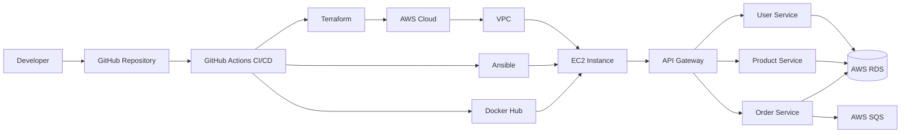

# System Architecture

## Architecture Overview

The project implements a cloud-native distributed microservices architecture deployed on AWS using Infrastructure as Code and fully automated CI/CD pipelines.

The architecture combines:

- Spring Boot microservices
- API Gateway routing
- Containerization with Docker
- Infrastructure provisioning using Terraform
- Automated deployment with GitHub Actions and Ansible
- AWS cloud-native services
- Event-driven communication using Amazon SQS

The platform was designed to demonstrate modern DevOps and Cloud Engineering practices, emphasizing:

- automation
- scalability
- reproducibility
- isolation
- infrastructure consistency
- deployment reliability

---

# High-Level Architecture



---

# Architectural Style

The system follows a:

- distributed microservices architecture
- API Gateway pattern
- event-driven communication model
- Infrastructure as Code deployment strategy

Each service is independently containerized and deployed.

---

# Main Components

| Component | Responsibility |
|---|---|
| API Gateway | Centralized routing and external entry point |
| User Service | User-related business logic |
| Product Service | Product-related operations |
| Order Service | Order processing and event publishing |
| Amazon SQS | Asynchronous communication |
| Amazon RDS | Persistent relational database |
| Docker | Container execution |
| Terraform | Infrastructure provisioning |
| Ansible | Server configuration and deployment |
| GitHub Actions | CI/CD automation |

---

# Microservices Architecture

## API Gateway

The API Gateway acts as the single external entry point for the system.

Responsibilities:

- request routing
- centralized access point
- internal service abstraction
- simplified client communication

The gateway forwards incoming requests to the appropriate microservice.

---

## User Service

Responsible for:

- user management
- user persistence
- user-related operations

Runs independently inside its own Docker container.

---

## Product Service

Responsible for:

- product management
- product catalog operations
- product persistence

Runs independently and communicates internally through Docker networking.

---

## Order Service

Responsible for:

- order processing
- order persistence
- event publishing

The service publishes asynchronous events into Amazon SQS queues.

---

# Service Isolation

Each service is:

- independently containerized
- independently deployable
- isolated through Docker containers
- connected through controlled internal networking

Benefits:

- improved maintainability
- independent deployment
- fault isolation
- simplified scaling

---

# API Communication Flow

## Synchronous Communication

External communication flow:

```text
Client → API Gateway → Microservice
```

The API Gateway exposes HTTP endpoints and forwards requests internally.

---

# Event-Driven Communication

## Asynchronous Messaging

The architecture uses Amazon SQS for asynchronous event-driven communication.

Current event producer:

- Order Service

Potential consumers:
- notification systems
- analytics services
- inventory services

---

# Why SQS Was Used

SQS was selected to demonstrate:

- decoupled architectures
- asynchronous communication
- resilient distributed systems
- failure isolation

Benefits:

- message durability
- retry mechanisms
- reduced temporal coupling
- improved scalability

---

# Database Architecture

## Amazon RDS

Persistent storage is handled through Amazon RDS.

RDS provides:

- managed PostgreSQL infrastructure
- persistent storage
- automated maintenance
- cloud-native database hosting

---

# Infrastructure Architecture

## Infrastructure as Code

Infrastructure provisioning is implemented using Terraform.

Terraform provisions:

- VPC
- subnets
- internet gateway
- route tables
- security groups
- EC2 instance
- RDS database
- SQS queues

---

# Why Terraform Was Chosen

Terraform enables:

- reproducible infrastructure
- version-controlled environments
- automated provisioning
- infrastructure consistency
- declarative cloud configuration

This removes manual AWS console configuration.

---

# Networking Design

## AWS Networking

The architecture uses:

- custom VPC
- public subnet
- internet gateway
- route tables
- security groups

---

## Docker Networking

Internally, services communicate through:

```text
microservices-network
```

This dedicated Docker network isolates internal service traffic.

---

# Public and Private Resources

## Public Resources

The following components are publicly accessible:

- API Gateway
- EC2 public IP
- SSH access

---

## Private/Internal Resources

The following remain internal:

- Docker internal networking
- microservice-to-microservice communication
- database communication

This minimizes exposure and reduces attack surface.

---

# Security Architecture

## IAM and OIDC

GitHub Actions authenticates into AWS using OpenID Connect (OIDC).

Benefits:

- temporary credentials
- no static AWS keys
- reduced credential exposure
- repository-scoped permissions

---

# Secrets Management

Sensitive information is managed through GitHub Secrets.

Examples:

- AWS_ROLE_TO_ASSUME
- EC2_SSH_PRIVATE_KEY

No secrets are stored inside source code.

---

# Security Groups

AWS Security Groups restrict network access.

Only required ports are exposed:

| Port | Purpose |
|---|---|
| 22 | SSH |
| 8080 | API Gateway |
| 8081 | User Service |
| 8082 | Product Service |
| 8083 | Order Service |

---

# CI/CD Architecture

## Continuous Integration

GitHub Actions automatically performs:

- Maven validation
- compilation
- Docker image build
- image publication

---

## Continuous Deployment

Deployment automation includes:

- Terraform provisioning
- EC2 configuration
- container deployment
- health validation

---

# Deployment Flow

```text
Developer Push
        ↓
GitHub Actions
        ↓
Docker Image Build
        ↓
Docker Hub Push
        ↓
Terraform Provisioning
        ↓
AWS Infrastructure
        ↓
Ansible Deployment
        ↓
Docker Container Execution
```

---

# Containerization Strategy

Each service contains:

- Spring Boot application
- dedicated Dockerfile
- isolated runtime environment

Advantages:

- portability
- reproducibility
- simplified deployment
- environment consistency

---

# Monitoring and Validation

Spring Boot Actuator endpoints are used for:

- health checks
- deployment validation
- service monitoring

Example:

```bash
curl http://<EC2_PUBLIC_IP>:8080/actuator/health
```

Expected result:

```json
{
  "status": "UP"
}
```

---

# Architectural Benefits

The implemented architecture provides:

- deployment automation
- infrastructure reproducibility
- service isolation
- scalable design
- cloud-native deployment
- improved maintainability
- CI/CD automation
- event-driven extensibility

---

# Current Architectural Limitations

Current limitations include:

- single EC2 deployment
- no load balancer
- no auto scaling
- no Kubernetes orchestration
- limited centralized monitoring
- no HTTPS termination

---

# Future Architectural Improvements

Potential future improvements:

- ECS or Kubernetes migration
- Application Load Balancer
- Auto Scaling Groups
- AWS Secrets Manager
- CloudWatch centralized logging
- OpenTelemetry tracing
- distributed monitoring
- blue/green deployments
- multi-environment support
- service discovery

---

# Final Architecture Result

The final architecture successfully demonstrates:

- cloud-native engineering
- Infrastructure as Code
- distributed systems
- automated CI/CD
- Docker orchestration
- AWS infrastructure provisioning
- event-driven communication
- modern DevOps practices

The system intentionally prioritizes:
- automation
- deployment reproducibility
- infrastructure reasoning
- operational reliability
- engineering architecture practices